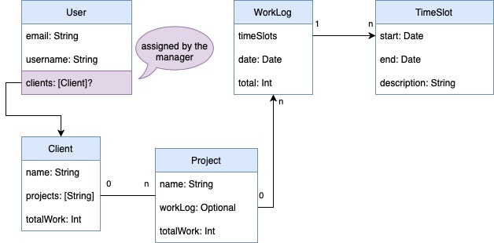

# TimeTracker  
`TimeTracker` is composed of two different projects, one is the `Client` app and one is the `Manager` app.
The big picture is that clients should be able to log their work hours and managers should be able to see those hours and generate invoices.

# Initial wireframes

 
Client app
 

 
Manager app
 

 
Manager time tab
 

# Models

If you want to update the models use the `Models.drawio` file located under the `/doc` folder so that everyone can see the changes
